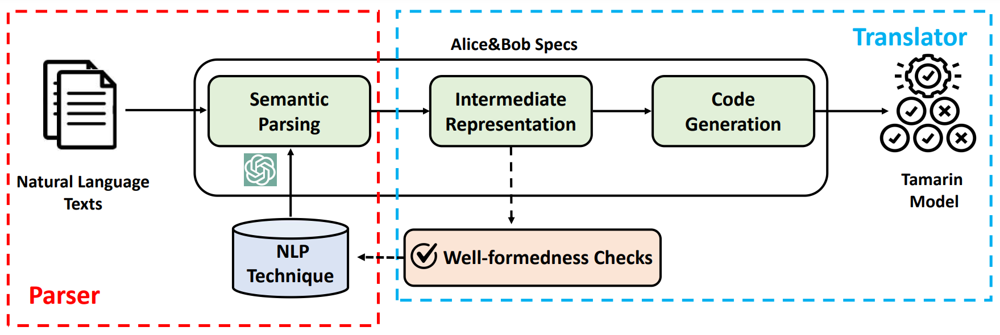

# 🤔⚒️: An Automated Framework to Translate NL to Symbolic Model for Verification⚙️

This repo contains code and test cases for our automated tool. The general front

## 💡 Introduction

This tool can generate formal specifications (symbolic model) for a protocol automatically from unstructed natural language, empowered by LLMs' powered ability for semantic parsing. Comparing with existing text-to-code tasks, we pay more attention on the soundness of the general translation process, i.e., the output of the tool should be consistent with the unstructed natural language description semantically. We try to make as much control as possible for the overall process, though "black-box" LLM is introduced.

<p align="center">
    
</p>

The tool can be divided into two parts, parser and translator roughly. The parser translates input natural language into @$\lambda$ lambda calculus. To capture and resolve the ambiguity and incompleteness of natural language, it generates a set of sub-calculus corrresponding to the original language fragments and allow users to amend (including add, delete and edit) them manually. The generated @$\lambda$ is transformed to an executable code snippet, which is checked by applying some program analysis techniques further. Once it passes the checks, an alice&bob style specification will be extracted, then it is translated to Multiset Rewriting Rules (MSRs), which can be accepted by the state-of-art protocol verifier-Tamarin.

## 🛠️ Setup

Setup the conda environments (optional), and install the related packages.
```bash
conda create -n llm4V python=3.10
conda activate llm4V
pip install -r requirements.txt
```
optional*
```
pip install -i https://pypi.tuna.tsinghua.edu.cn/simple -r requirements.txt
```

## 🚀 Get Started

- Configure openai API key in src/oai_key.txt,
- run the tool's frontend
    ```bash
    cd src
    python -m flask --app frontend.py run
    ```
- add ```--debug``` for debug mode.
- Then open web-based tool at http://127.0.0.1:5000

## 💬 User tutorial

Here gives an overivew for the general workflow of the tool. We use a toy example to illustrate how user can interact with the tool and how tool can generate formal specificaions and check the results automatically.


### Config parameter 


## 🖖 Acknowledge

The frontend our tool is based on `nl2spec`, which is a novel tool applying LLMs to derive formal specifications in temporal logics. We preserve the feature which allows user to incorperate and edit the generated formal specifciations.