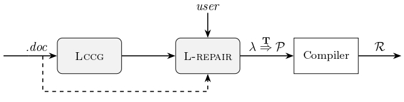

# LLM-Aided Automatic Modelling for Security Protocol Verification

This repo contains a benchmark for symbolic model synthesis and a tool with web-based frontend.

## Introduction

This tool can generate formal specifications (symbolic model) for a protocol automatically from unstructed natural language, empowered by LLMs' powered ability for semantic parsing. Comparing with existing text-to-code tasks, we pay more attention on the soundness of the general translation process, i.e., the output of the tool should be consistent with the unstructed natural language description semantically. We try to make as much control as possible for the overall process, though "black-box" LLM is introduced.

<!-- { width=50% } -->


1. **Lccg:** a LLM-powered CCG parser, which takes protocol documents as input, parses them into lambda calculus expressions (that are defined specifically for modeling security protocols).
2. **L-repair:** which repairs the broken specifications with static analysis techniques and user interaction to make them well-formed.
3. **Algorithm T:** which transforms the lambda expressions into **Sapic+** specification **P**.
4. **Compiler:** which takes the well-formed **Sapic+** process **P** as input and compiles it into models **R** accepted by the protocol verifiers (**Tamarin**, **DeepSec**, and **ProVerif**) directly.


## Setup

1. Install Tamarin-prover
- Follow the [Tamarin manual](https://tamarin-prover.com/manual/master/book/002_installation.html).
    ```bash
    brew install tamarin-prover/tap/tamarin-prover
    ```
- Make sure the prover equipped with a Sapic+ [1] platform.


2. Setup the conda environments, and install the related packages.
    ```bash
    conda create -n llm4V python=3.10
    conda activate llm4V
    pip install -r requirements.txt
    ```

## Configure

- Configure openai API key in src/conf/config.json,
    ```json
    {
      "API_URL_BASE": <YOUR API URL BASE>,
      "openai_api_key": <YOUR OPENAI KEY>,
    }
    ```
- run the tool's frontend
    ```bash
    cd src
    python -m flask --app tool run
    ```
**I recommend use ```python -m flask --app rewrite run``` to use the lastest version of the tool.**
- (Optional) add ```--debug``` for debug mode.
- Then open web-based tool at http://127.0.0.1:5000


## Directories structure
```
⚒️ AutoSM 
├── 📂 ComplementaryExperiments
├── 📂 Input_output
├── 📂 src: The source code.
├── 📂 static
└── 📂 templates
  └── 📜 home.html
```
- 📂 ComplementaryExperiments: Comparisons with one correct-by-construction approach
- 📂 Input_output: The examples used to present the workflow.
- 📂 src: the source code of our implementation
- 📂 static: static configurations including images and .css file.
- 📂 templates: html page of web-based frontend 

## User tutorial

Here gives an overivew for the general workflow of the tool. We use a toy example to illustrate how user can interact with the tool and how tool can generate formal specificaions and check the results automatically.


