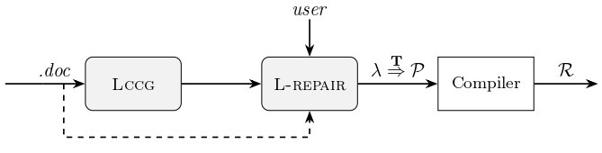

# LLM-Aided Automatic Modelling for Security Protocol Verification

This repo contains a benchmark for symbolic model synthesis and a tool with web-based frontend.

## Introduction

This tool can generate formal specifications (symbolic model) for a protocol automatically from unstructed natural language, empowered by LLMs' powered ability for semantic parsing. Comparing with existing text-to-code tasks, we pay more attention on the trustworthiness
of the general translation process, i.e., the output of the tool should be consistent with the unstructed natural language description semantically. We try to make as much control as possible for the overall process (at least, provide some evidence of the trustworthiness for a non-expert user), though "black-box" LLM is introduced. 
The tool is composed of four stages, transitioning from natural language input to a Tamarin model:

<!-- { width=50% }
 -->

1. Parser, a LLM-powered CCG parser, which takes protocol documents as input, parses them into lambda calculus expressions (that are defined specifically for modeling security protocols).
2. Repairer, which repairs the broken specifications with static analysis techniques and user interaction to make them well-formed.
3. Rewriter, which transforms the lambda expressions into Sapic+ [1] specification.
4. Compiler, which is designed and implemented by Cheval et al., taking the well-formed Sapic+ process as input and compiles it into models accepted by the protocol verifiers (Tamarin, DeepSec, and ProVerif) directly.


## Setup

1. Install Tamarin-prover
- Follow the [Tamarin manual](https://tamarin-prover.com/manual/master/book/002_installation.html).
    ```bash
    brew install tamarin-prover/tap/tamarin-prover
    ```
- Make sure the prover equipped with a Sapic+ platform.
- To check the installation of Tamarin, enter the command tamarin-prover --version in the command line. The output should resemble the following:
  ```
  tamarin-prover 1.8.0, (C) David Basin, Cas Cremers, Jannik Dreier, Simon Meier, Ralf Sasse, Benedikt Schmidt, 2010-2023

  This program comes with ABSOLUTELY NO WARRANTY. It is free software, and you
  are welcome to redistribute it according to its LICENSE, see
  'https://github.com/tamarin-prover/tamarin-prover/blob/master/LICENSE'.

  maude tool: 'maude'
  checking version: 2.7.1. OK.
  checking installation: OK.
  Generated from:
  Tamarin version 1.8.0
  Maude version 2.7.1
  ```

2. Setup the conda environments, and install the related packages.
    ```bash
    conda create -n llm4V python=3.10
    conda activate llm4V
    pip install -r requirements.txt
    ```

## Configuration

- Configure openai API key in src/conf/config.json,
    ```json
    {
      "API_URL_BASE": "YOUR API URL BASE",
      "openai_api_key": "YOUR OPENAI KEY",
    }
    ```
- run the tool's frontend
    ```bash
    cd src
    python -m flask --app tool run
    ```
**I recommend use ```python -m flask --app rewrite run``` to use the lastest version of the tool.**
- (Optional) add ```--debug``` for debug mode.
- Then open web-based tool at http://127.0.0.1:5000


## Directories structure
```
📂 AutoSM 
├── 📂 ComplementaryExperiments
├── 📂 Input_output
├── 📂 src: The source code.
├── 📂 static
└── 📂 templates
  └── 📜 home.html
```
- `ComplementaryExperiments`: Comparisons with one correct-by-construction approach
- `Input_output`: The examples used to present the workflow.
- `src`: the source code of our implementation
- `static`: static configurations including images and .css file.
- `templates`: html page of web-based frontend 

## Benchmark
| Source               | Title                                                                                        | Authors                                    | Link                                                                                                      | Note                                                                                                                                                                                        |
|----------------------|----------------------------------------------------------------------------------------------|--------------------------------------------|-----------------------------------------------------------------------------------------------------------|---------------------------------------------------------------------------------------------------------------------------------------------------------------------------------------------|
| GIAC paper           | Otway-Rees Key Exchange Protocol Specification                                               |                                            | [Link](https://www.giac.org/paper/gcih/81/man-in-the-middle-attack-initiator-otway-rees-key-exchange-protocol/100561) | We have rearranged the content order on page 6 of the original paper. Specifically, we have moved Table 2, which illustrates the messages in each step, to the description section.        |
| Wikipedia            | Needham–Schroeder Symmetric protocol                                                         |                                            | [Link](https://en.wikipedia.org/wiki/Needham%E2%80%93Schroeder_protocol)                                  |                                                                                                                                                                                             |
| Teaching Assignment  | Description of the Needham Schroeder public key protocol and its attack                      |                                            | [Link](https://members.loria.fr/VCortier/files/School/NS.pdf)                                             |                                                                                                                                                                                             |
| CCS 2020             | Post-Quantum TLS Without Handshake Signatures (Full version, March 15, 2022)                 | Peter Schwabe, Douglas Stebila, Thom Wiggers | [Link](https://eprint.iacr.org/2020/534.pdf)                                                              | The protocol description is excerpted from Section 3, page 5 of the original paper.                                                                                                         |
| Tamarin-manual       |                                                                                              |                                            | [Link](https://tamarin-prover.com/manual/master/book/005_protocol-specification-rules.html)               |                                                                                                                                                                                             |
| RFC 4253             | The Secure Shell (SSH) Transport Layer Protocol                                              | T. Ylonen, C. Lonvick, Ed.                 | [Link](https://datatracker.ietf.org/doc/html/rfc4253)                                                     | We only select Section 8 and Section 7.2 as input, excluding other parts. These sections are reordered to reflect the actual order of protocol execution; that is, first performing the key exchange (Section 8), followed by retrieving the key from shared keys (Section 7.2). |


## User tutorial

Here gives an overivew for the general workflow of the tool. We use a toy example to illustrate how user can interact with the tool and how tool can generate formal specificaions and check the results automatically.

## Reference

[1] Cheval, Vincent, Charlie Jacomme, Steve Kremer, and Robert Künnemann. 2022. ''SAPIC+: Protocol Verifiers of the World, Unite!'' In 31st USENIX Security Symposium (USENIX Security 22), 3935–52.


